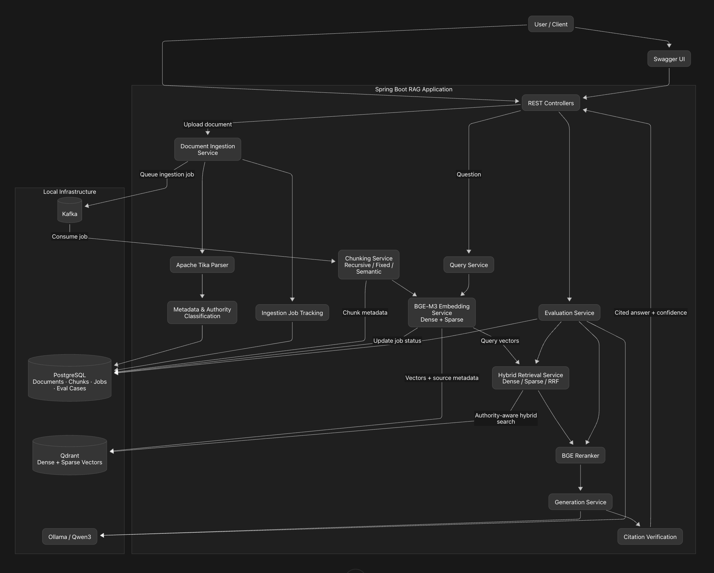
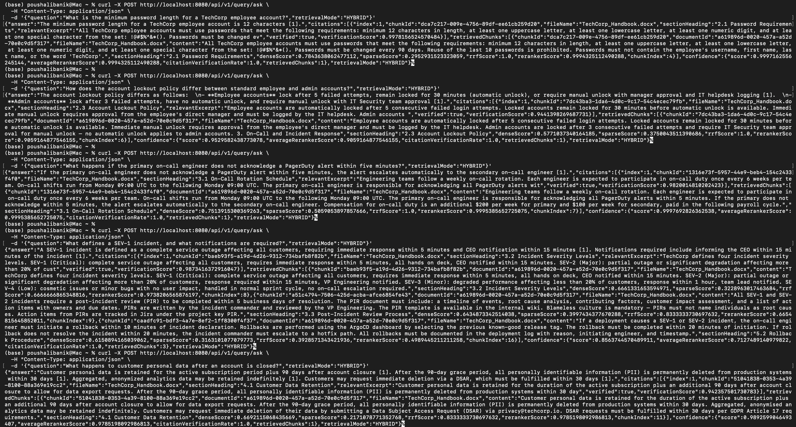
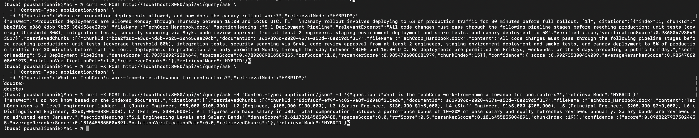
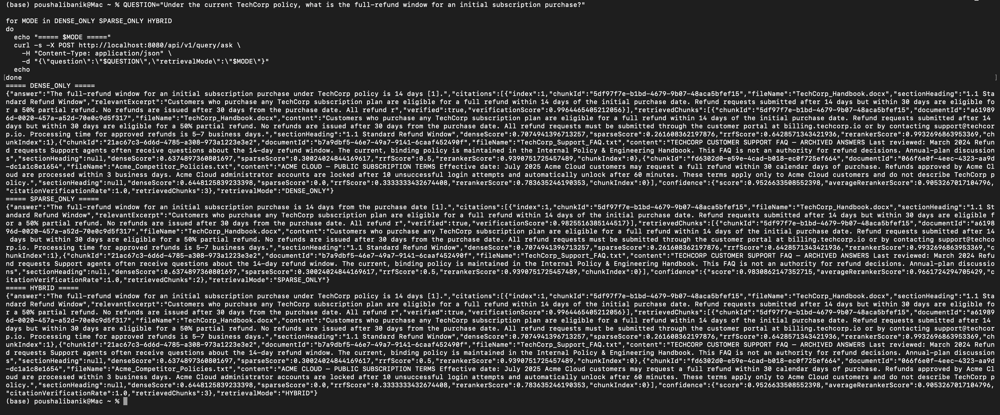
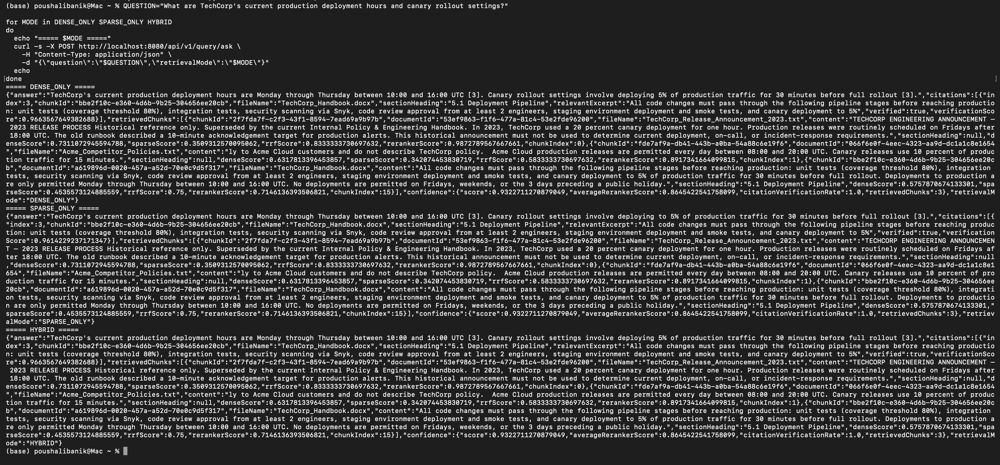
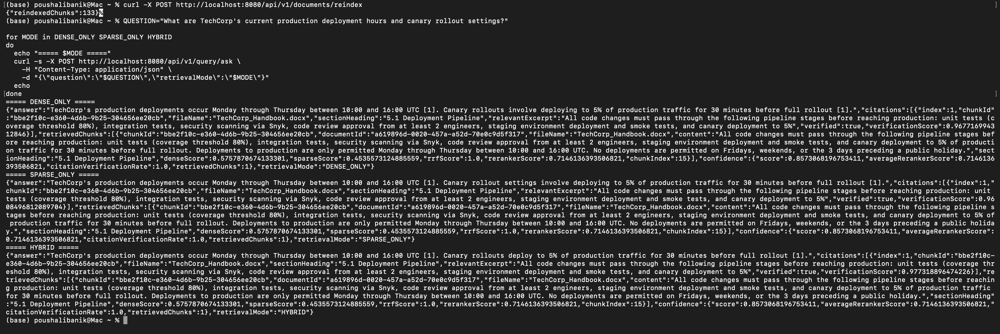
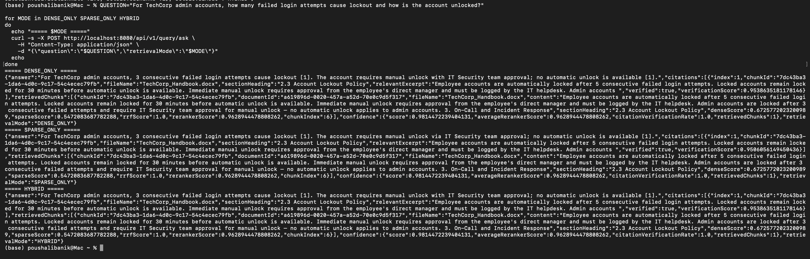
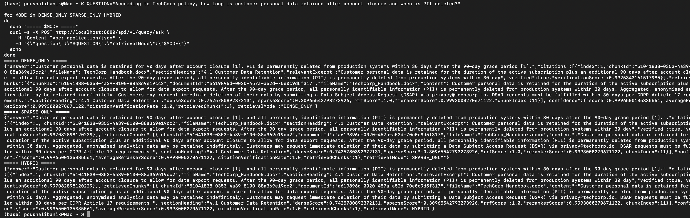

# RAG Hybrid Search

A local Java 21 / Spring Boot Retrieval-Augmented Generation (RAG) application. It indexes documents asynchronously, retrieves them through dense, sparse, or hybrid search, reranks the results, and generates cited answers with Qwen3 running locally through Ollama.

## Features

- Spring Boot REST API with Swagger UI.
- Apache Tika parsing for TXT, DOCX, PDF, and other supported document formats.
- Kafka-based asynchronous ingestion with three retry attempts, exponential backoff, and dead-letter failure handling.
- PostgreSQL storage for documents, chunks, ingestion jobs, and evaluation cases.
- Qdrant named-vector collection with BGE-M3 dense and sparse vectors plus reciprocal-rank fusion (RRF) hybrid search.
- BGE reranker for selecting the most relevant context before generation.
- Qwen3 / Ollama answer generation with `[N]` citations and citation verification.
- `RECURSIVE`, `FIXED_SIZE`, and embedding-based `SEMANTIC` chunking.
- Content-hash idempotency: uploading identical content returns the existing document instead of creating duplicate chunks.
- Source metadata (`organization`, `authority`, `documentType`, `current`) and authority-aware filtering for policy queries.
- Low-confidence abstention: unsupported or weakly retrieved questions return `I do not know based on the indexed documents.`
- Evaluation endpoints for retrieval MRR@5, Recall@20, answer correctness, faithfulness, and citation accuracy.

## Technology stack

| Area | Technology used |
| --- | --- |
| Language and build | Java 21, Gradle |
| Application framework | Spring Boot 3.3.4: Web MVC, Validation, Data JPA, Actuator, and Spring Kafka |
| LLM integration | LangChain4j 0.36.0 with the LangChain4j Ollama integration |
| Generation model | Qwen3 (`qwen3:8b`) served locally by Ollama |
| Embeddings and reranking | BGE-M3 and BGE Reranker ONNX models, ONNX Runtime, and DJL Hugging Face Tokenizers |
| Vector database | Qdrant Java gRPC client with named dense and sparse vectors |
| Relational database | PostgreSQL with Hibernate/JPA and Flyway migrations |
| Asynchronous processing | Apache Kafka with Spring Kafka retries and dead-letter handling |
| Document parsing | Apache Tika Core and Tika Parsers Standard Package |
| API documentation | Springdoc OpenAPI / Swagger UI |
| Serialization and boilerplate | Jackson and Lombok |
| Test dependencies | JUnit 5 through Spring Boot Test, Spring Kafka Test, and Testcontainers for PostgreSQL/Kafka |

The project uses **LangChain4j** for Java-to-Ollama LLM integration. It does **not** use Python LangChain or LangGraph; workflow orchestration is implemented with Spring services and Kafka.

## High-level architecture



### How the flow works

1. **Upload:** A client uploads a document through Swagger UI or `POST /api/v1/documents/ingest`.
2. **Parse and register:** Apache Tika extracts text. The application records the document, its content hash, authority metadata, and a durable ingestion job in PostgreSQL. Identical content returns the existing document instead of being indexed twice.
3. **Queue and index:** The application places the job on Kafka. A consumer parses the job, chunks the text according to the selected strategy, stores chunk metadata in PostgreSQL, generates BGE-M3 dense and sparse vectors, and upserts them to Qdrant.
4. **Track completion:** Successful jobs become `INDEXED`. Failures retry three times with exponential backoff; an exhausted job becomes `FAILED` and records its error.
5. **Ask a question:** A client sends a question to `POST /api/v1/query/ask`. BGE-M3 converts the question into dense and sparse query vectors.
6. **Retrieve and filter:** Qdrant retrieves candidate chunks using dense-only, sparse-only, or RRF hybrid search. Authority-aware filtering prevents current-policy questions from using historical, external, or reference documents when an authoritative current source is required.
7. **Rerank and generate:** The BGE reranker selects the strongest context. Qwen3, running through Ollama, produces an answer grounded only in that context.
8. **Cite or abstain:** The application verifies citations against retrieved chunks and returns the answer, sources, retrieved chunks, and confidence. If no chunk clears the relevance gate, it returns `I do not know based on the indexed documents.`
9. **Evaluate:** The evaluation APIs use the stored test cases to compare retrieval modes and measure MRR@5, Recall@20, correctness, faithfulness, and citation accuracy.

## Requirements

- Java 21
- PostgreSQL
- Apache Kafka
- Qdrant
- Ollama with `qwen3:8b` (or the model configured in `application.yml`)
- BGE-M3 ONNX model, external model data if supplied by the model, and tokenizer
- BGE reranker ONNX model and tokenizer

This project can run entirely without Docker. Ensure the local services below are running and match the ports in `src/main/resources/application.yml`:

| Service | Default local address |
| --- | --- |
| PostgreSQL | `localhost:5432` |
| Kafka | `localhost:9092` |
| Qdrant gRPC | `localhost:6334` |
| Ollama | `localhost:11434` |
| Application | `localhost:8080` |

## Initial setup

1. Create the PostgreSQL database and user referenced by `application.yml`.

2. Start PostgreSQL, Kafka, Qdrant, and Ollama locally.

3. Download the required models and place them under the project directory:

```text
models/
├── bge-m3/
│   ├── model.onnx
│   ├── model.onnx_data        # required when supplied with the model
│   └── tokenizer.json
└── bge-reranker-v2-m3/
    ├── model.onnx
    └── tokenizer.json
```

4. Make the configured Ollama model available:

```bash
ollama pull qwen3:8b
```

5. From the project root, compile, test, and run the application:

```bash
./gradlew clean test
./gradlew bootRun
```

Flyway applies database migrations automatically at startup. Keep the application running in this terminal while using the API from a second terminal.

## API documentation

After startup, open [Swagger UI](http://localhost:8080/swagger-ui/index.html).

Useful endpoints:

- `POST /api/v1/documents/ingest` — upload a document.
- `GET /api/v1/documents` — list documents.
- `GET /api/v1/documents/{id}` — fetch one document record.
- `GET /api/v1/documents/{id}/jobs` — check its asynchronous ingestion state.
- `POST /api/v1/documents/reindex` — re-upsert all stored chunks into Qdrant.
- `POST /api/v1/query/ask` — ask a question.
- `POST /api/v1/eval/retrieval` — calculate retrieval-only metrics.
- `POST /api/v1/eval/run` and `POST /api/v1/eval/run/compare` — run full evaluations.

## Ingest a document

Use explicit metadata for authoritative production material. `RECURSIVE` is the recommended default; `SEMANTIC` uses sentence embeddings and is slower, but can make topic boundaries cleaner.

```bash
curl -X POST http://localhost:8080/api/v1/documents/ingest \
  -F "file=@/absolute/path/policy.docx" \
  -F "chunkingStrategy=SEMANTIC" \
  -F "organization=TechCorp" \
  -F "authority=AUTHORITATIVE" \
  -F "documentType=POLICY" \
  -F "current=true"
```

The immediate response has a document `id` and is normally `PENDING`. Use that ID to monitor processing:

```bash
curl http://localhost:8080/api/v1/documents/DOCUMENT_ID/jobs
```

Expected final state:

```json
{
  "status": "INDEXED",
  "attempts": 1
}
```

If indexing fails, the job is retried three times. After the final failure, the job and document are marked `FAILED` with the available error message.

## Ask questions

```bash
curl -X POST http://localhost:8080/api/v1/query/ask \
  -H "Content-Type: application/json" \
  -d '{"question":"What is the minimum password length for a TechCorp employee account?","retrievalMode":"HYBRID"}'
```

Available retrieval modes:

- `HYBRID` — dense + sparse Qdrant search fused with RRF; recommended default.
- `DENSE_ONLY` — semantic/vector matching only.
- `SPARSE_ONLY` — lexical/token matching only.

Responses include the answer, citations, retrieved chunks, reranker scores, citation verification, and a confidence summary. Confidence supports evaluation; it is not a guarantee that an answer is complete or correct.

## Tests performed

The following manual tests were completed against the local environment:

1. Ingested the TechCorp Handbook and confirmed structured section headings are preserved in chunks.
2. Loaded 20 evaluation cases into PostgreSQL and ran retrieval evaluation for hybrid, dense-only, and sparse-only modes.
3. Verified the refund-policy debug case retrieved the expected `1.1 Standard Refund Window` chunk at rank 1.
4. Tested noisy multi-document retrieval containing external, historical, FAQ, and training documents. Authority-aware filtering kept current TechCorp policy questions scoped to the authoritative current handbook.
5. Tested cited answers for password requirements, account lockout policy, deployment policy, and data-retention policy.
6. Tested a revised Acme policy file using `SEMANTIC` chunking and confirmed its job reached `INDEXED`.
7. Uploaded the same semantic test file twice. The second request returned the same document ID, confirming idempotent ingestion and no duplicate chunk creation.
8. Tested an unsupported question and confirmed the application abstains with `I do not know based on the indexed documents.`

### Core functional-answering scenarios

#### Supported policy questions with verified citations

This test exercises multiple distinct TechCorp handbook sections through `HYBRID` retrieval: password requirements, employee versus admin account lockout handling, on-call escalation, SEV-1 incident response, and customer data retention. Each response is expected to cite the applicable handbook section and return a high citation-verification score.



#### Supported answer versus safe abstention

This test first asks a supported deployment-policy question and receives the authoritative deployment window and canary settings. It then asks about a contractor work-from-home allowance, which is not present in the indexed documents. The expected safe result is: `I do not know based on the indexed documents.`



### Noisy multi-document retrieval scenarios

The evaluation corpus deliberately includes an authoritative current TechCorp handbook alongside a historical TechCorp release announcement, a non-authoritative support FAQ, external Acme competitor policies, and generic training material. These are *noisy* because they contain overlapping terminology, plausible but conflicting values, and historical guidance that should not answer a current-policy question.

#### Scenario 1 — company and policy disambiguation

Question: *Under the current TechCorp policy, what is the full-refund window for an initial subscription purchase?*

The expected source is the current TechCorp handbook: a **14-day** full-refund window. This scenario checks that the system identifies the requested company and policy despite refund-related FAQ and Acme competitor content.



#### Scenario 2 — current policy versus old TechCorp guidance

Question: *What are TechCorp's current production deployment hours and canary rollout settings?*

The expected source is the current handbook: **Monday–Thursday, 10:00–16:00 UTC**, with a **5% canary for 30 minutes**. The initial noisy-corpus result shows historical and external documents competing in the retrieved context.



After authority-aware context filtering and reindexing, the same query retrieves only the current authoritative handbook section.



#### Scenario 3 — exact security policy amid conflicting competitor content

Question: *For TechCorp admin accounts, how many failed login attempts cause lockout and how is the account unlocked?*

The expected result is **three failed attempts**, followed by a manual unlock approved by the IT Security team; admin accounts have **no automatic unlock**. This distinguishes the authoritative TechCorp security policy from conflicting competitor account-lockout values.



#### Scenario 4 — privacy terminology ambiguity

Question: *According to TechCorp policy, how long is customer personal data retained after account closure and when is PII deleted?*

This scenario tests customer-data retention terminology against generic privacy/training material. The expected authoritative result is that data is retained for **90 days after account closure**, and personally identifiable information (PII) is permanently deleted from production systems **within 30 days after that 90-day grace period**. All retrieval modes selected the authoritative `4.1 Customer Data Retention` section.



Run the automated test suite before committing changes:

```bash
./gradlew clean test
```

Run the retrieval regression evaluation after changing chunking, metadata filters, embedding models, or retrieval settings:

```bash
curl -X POST "http://localhost:8080/api/v1/eval/retrieval?retrievalMode=HYBRID"
```

The current TechCorp test dataset contains 20 cases. Previous baseline results were `MRR@5 = 1.0` and `Recall@20 = 1.0`; treat these as a small controlled-corpus baseline, not proof of general production quality.

## Future enhancements

- Authentication and role-based authorization.
- Secrets outside `application.yml` — the database password is currently hardcoded.
- File-size/type limits, antivirus scanning, and upload rate limits.
- Production observability: structured logs, metrics, alerts, and tracing.
- Kafka transactional outbox/idempotent consumer design for database–Kafka consistency.
- Better automated test coverage, including failure/retry, duplicate-upload, and no-answer integration tests.
- Database/Qdrant backups, retention rules, encryption, and PII controls.
- Deployment configuration: HTTPS, health checks, resource limits, environment profiles, and CI/CD.
